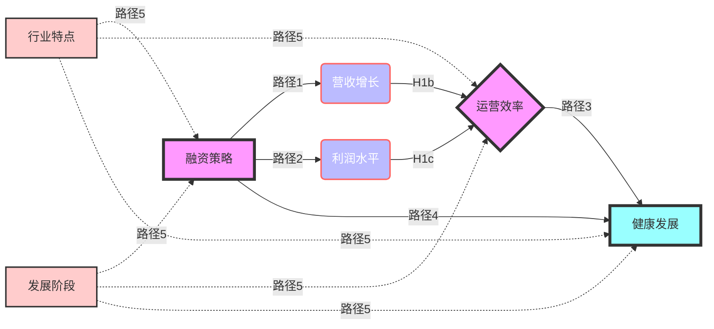

```mermaid
graph LR
A[融资策略] --路径1--> B(营收增长)
A --路径2--> C(利润水平)
B --H1b--> D{运营效率}
C --H1c--> D
D --路径3--> E[健康发展]
A --路径4--> E
F[行业特点] -.路径5.-> A
G[发展阶段] -.路径5.-> A
F -.路径5.-> D
F -.路径5.-> E
G -.路径5.-> D
G -.路径5.-> E

style A fill:#f9f,stroke:#333,stroke-width:4px
style B fill:#bbf,stroke:#f66,stroke-width:2px,color:#fff
style C fill:#bbf,stroke:#f66,stroke-width:2px,color:#fff
style D fill:#f9f,stroke:#333,stroke-width:4px
style E fill:#9ff,stroke:#333,stroke-width:4px
style F fill:#fcc,stroke:#333,stroke-width:2px
style G fill:#fcc,stroke:#333,stroke-width:2px
```